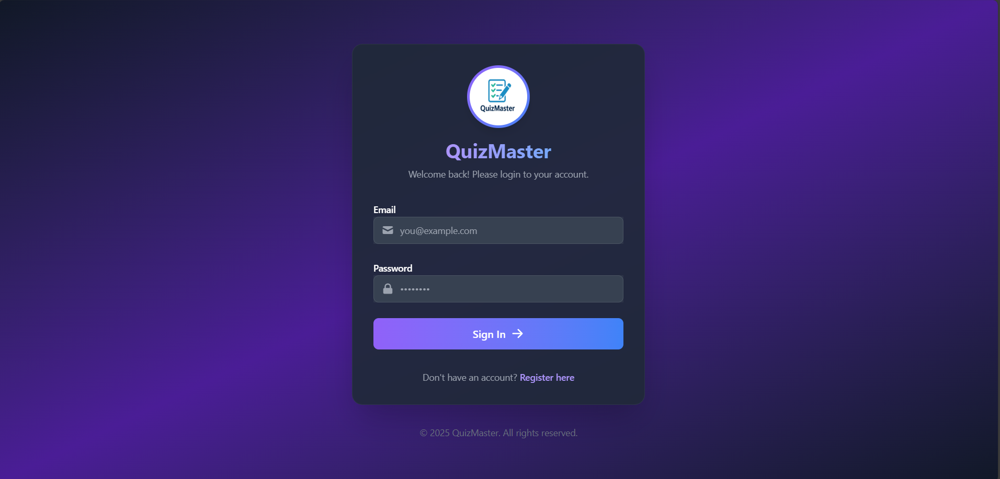
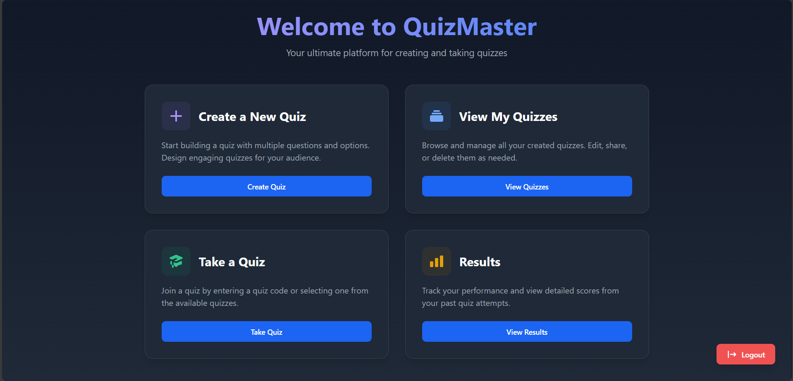
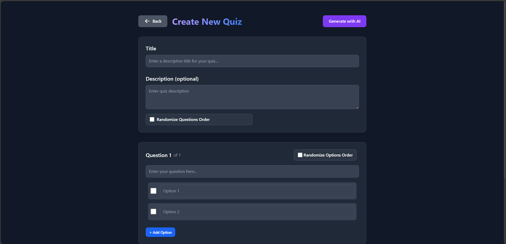
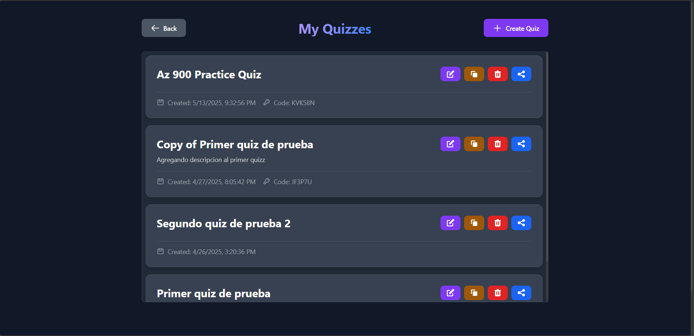
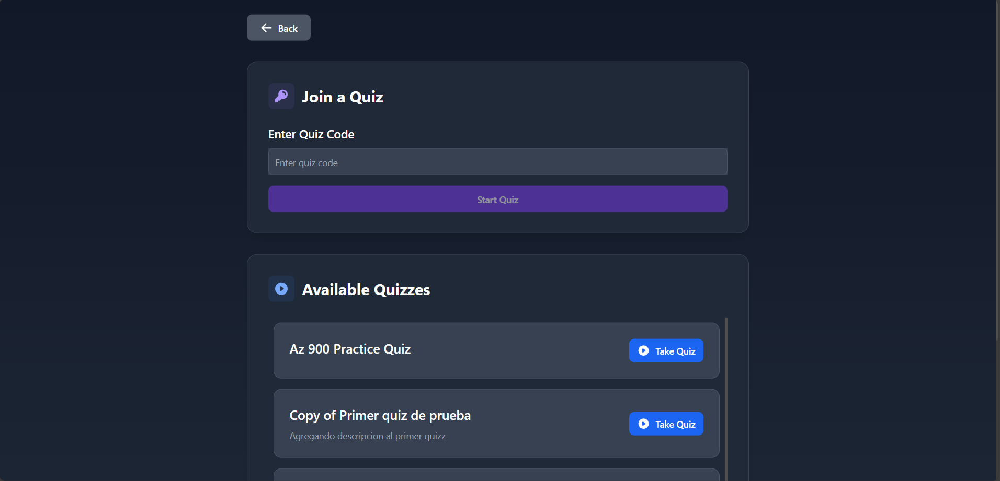
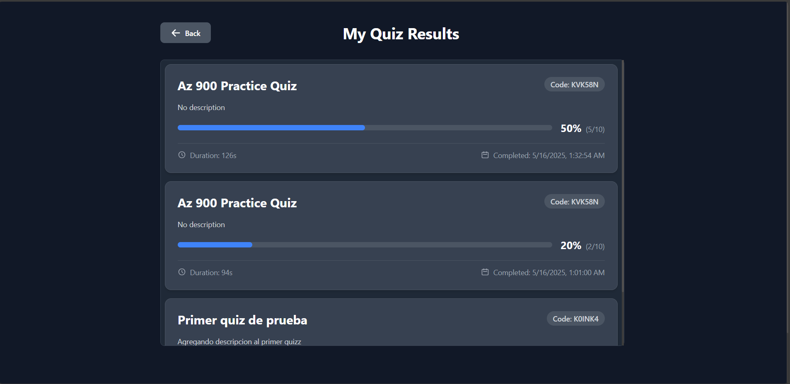

# QuizMaster

**QuizMaster** is a full-stack web application that allows users to create, share, and complete quizzes. It features user authentication, quiz generation with multiple options, email notifications, and result tracking. The platform is ideal for learning reinforcement, exam practice, or fun trivia.

## 🌐 Tech Stack

### Frontend
- **React** with **TypeScript**
- **Vite** for fast development
- **Tailwind CSS** and **Flowbite React** for UI components

### Backend
- **ASP.NET Core (C#)** Web API
- **Entity Framework Core** for ORM
- **SQL Server** for data persistence

## 🚀 Features

- User registration and login with JWT authentication
- Quiz creation with multiple questions and options
- Option to mark one or more correct answers
- Quiz result recording and score display
- Shareable quiz links via code
- View all quizzes created by the logged-in user
- Email notifications on signup and results
- AI-generated quizzes using DeepSeek integration
- Backend support for quiz result analytics

## 📸 Screenshots

### 1. Login Page

User login form with credential validation.  

### 2. Home Page

Overview of the platform and call-to-action for users.  

### 3. Create Quiz

Allows users to define title, questions, and correct options.  

### 4. My Quizzes

Dashboard showing all quizzes created by the logged-in user.  

### 5. Take Quiz

Interface to answer a quiz with progress tracking and final score.  

### 6. Quiz Results

Displays score, time taken, and detailed feedback.  

## 📈 Future Improvements

- Add quiz categories or tags  
- Timer-based quizzes  
- Admin panel for moderation  
- Analytics dashboard for users  
- Role-based access control for quiz visibility  

## 👥 Author

**Carlos Arias**

